# ARG - ENIGMA DO MEDO
O ARG de Enigma do Medo é um evento especial realizado nas redes sociais de Ordem Paranormal que teve seu início no dia *17 de outubro de 2024*. Esse jogo de realidade alternativa foi feito com o objetivo de apresentar várias informações, aspectos e temáticas acerca de Enigma do Medo, sendo abaixo documentado na ordem de suas respectivas resoluções.

Início
No dia *17 de outubro de 2024*, no aniversário de quatro anos do anúncio de Enigma do Medo, às **16h13** (referenciando a sequência **0413**), foi postado uma [imagem](https://x.com/OrdemParanormal/status/1846992828196692220/photo/1) nas redes sociais oficiais de Ordem Paranormal, com vários itens espalhados como diversos papéis sobre uma mesa e uma lanterna UV junto ao símbolo do Medo ao centro formado por recortes das folhas. Nos documentos, podem ser identificados algumas menções e referências ao jogo:
<center>

Ele retornará;

Ele está observando;

Entre em contato - DESAPARECIDO;

TUDO precisa estar pronto;

Quatro anos, quatro anos, quatro anos...

O dia está chegando, o dia está chegando, o dia
 
está chegando...

Todas as histórias precisam ser contadas um dia.
</center>

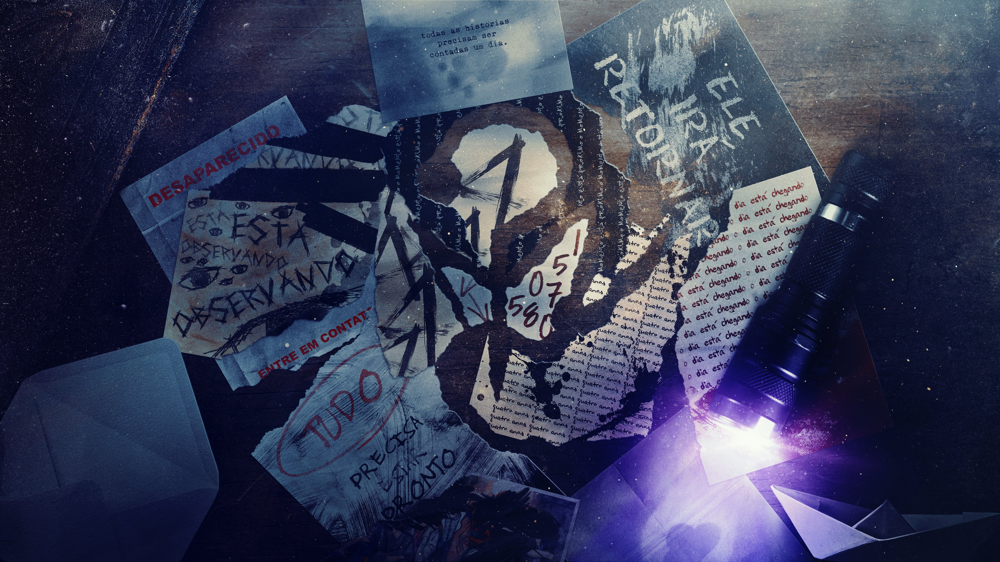

Logo após a publicação misteriosa, foram adicionadas novas imagens codificadas nas páginas oficiais de Enigma do Medo na [Steam](https://shared.fastly.steamstatic.com/store_item_assets/steam/apps/1507580/extras/cima.png?t=1729193582) e na [Nuuvem](https://www.nuuvem.com/lp/pt/enigma-do-medo/images/baixo.png) na estrutura textual do site. Cada uma das plataformas estava mencionada na foto misteriosa, com o ID do jogo na Steam à mostra em um papel pequeno (**1507580**), e o logotipo da Nuuvem sendo mostrado pela lanterna UV.

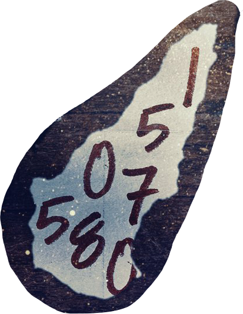


## 1 - Mia e Verissímo.
Essas imagens faziam parte da arte comemorativa postada nas redes sociais de Ordem Paranormal durante o Natal de 2022, onde Mia e o Senhor Veríssimo estão presentes.

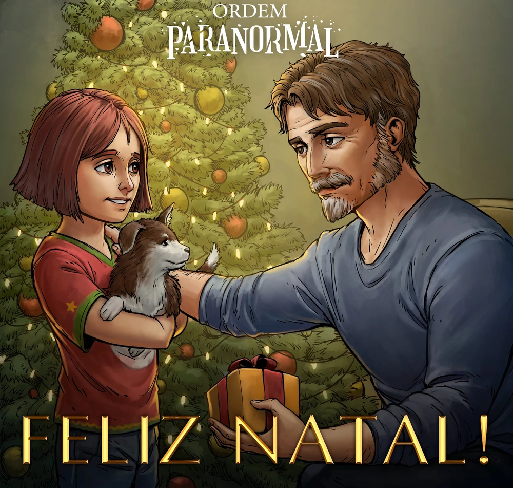

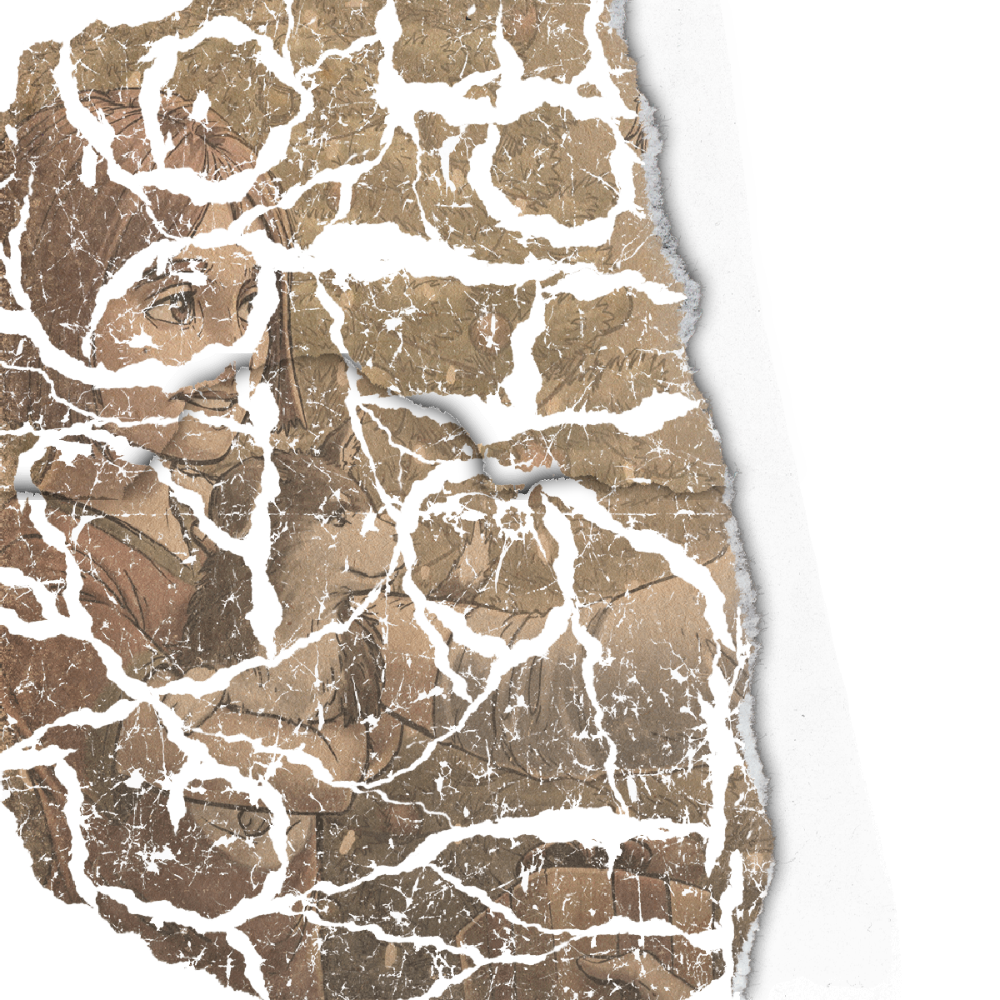

Ao unir as duas imagens e rotacionar *90°* em sentido horário, descobrimos uma série de caracteres escondida em meio aos recortes das fotos: `GX266lL9HcE`. Usando esses caracteres como se fossem um link de um vídeo do YouTube, chegamos a próxima parte.

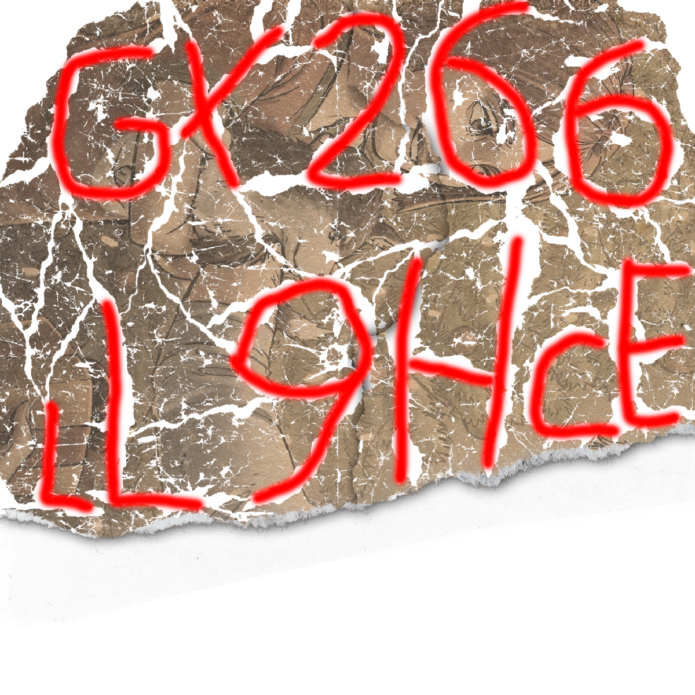


### Youtube
https://www.youtube.com/watch?v=GX266lL9HcE


https://github.com/user-attachments/assets/93fe9d19-30f2-4823-b50c-25aac1de0567


#### Informações
* Nome do video: ?
* Nome do canal: v1s_un1ta_f0rt10r
* Nome do canal está em leetcode.
Ou seja algumas letras foram trocadas por números.

A tradução fica em latim de **Vis Unita Fortior** significa *"Unidos Venceremos"*.

O vídeo que tínhamos achado continha Mia segurando e piscando uma lanterna UV contra uma parede com desenhos de adultos e crianças que aparecem alternadamente, junto de Lupi latindo e rosnando ao fundo.

Fazendo relação com "O Deus do Medo está observando".
Ela está aflita e respirando fundo.

Interpretando a figura adulta como um risco e a figura criança como um ponto, começamos a decodificar um Código Morse:
```bash
.- .-.. . .- -....- .. .- -.-. - .- -....- . ... - 
```

Tradução para o Morse: `ALEA-IACTA-EST` (Uma frase em latim que significa "*o dado foi lançado*")

Além disso nesse video podemos ouvir um cachorro latindo.
Temos que pegar o momento que que a lanterna está acessa e os latidos do cachorro sendo
rosnado sendo risco e latido igual a ponto. Com isso, conseguimos:
```bash
-- .- ..- ...- .- .. ... .--. .-. . ... .- --. . 
```

Traduzindo temos: `mauvaispresage` (Uma palavra em Francês que significa '*Mau Presságio*')

Se olharmos bem a forma como a lanterna ascende num formato que parece ser o Instagram.

### Instagram
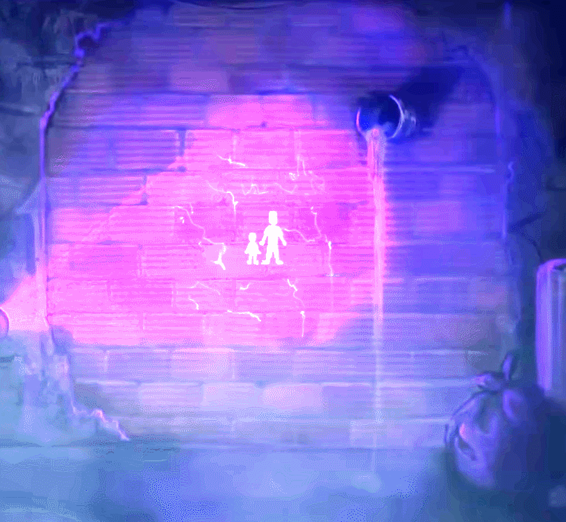

Indo para o Instagram procuramos pelas frases e mensagens que temos.

Encontramos a conta do `v1s_un1ta_f0rt10r` no [Instagram](https://www.instagram.com/v1s_un1ta_f0rt10r)

Essa conta possuía uma foto de perfil que parece ser o espantalho do jogo.

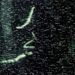

Acessando o Instagram, vimos que 13 horas antes do enigma começar, a conta havia postado diversos [stories](https://www.instagram.com/stories/highlights/18027647033147850/), sendo uma sequência de imagens alternadas entre preto e branco.

Basicamente nesse story temos:
* Preto atraso muito longo temos "-"
* Preto com atraso curto temos "."
* Branco com atraso rápido temos " "

Juntando todos os stories temos um código morse novamente.

```bash
--- - .... ...-- .-. .-.-.- ... .. - . -..-.
```
### Oth3r Site

O resultado desse morse é [oth3r site](https://oth3r.site)

Ao acessar esse site você é direcionado para a página da steam do jogo [Steam](https://store.steampowered.com/app/1507580/).

Porém ao colocar 
**ALEA-IACTA-EST** no final do link [https://oth3r.site/ALEA-IACTA-ES](https://oth3r.site/ALEA-IACTA-ES) somos redirecionados para um link do mega:
[aleiactaest](https://mega.nz/file/RRAESJYA#X6MzrpBgvoEcnBcduMgbaC2e-cb7ETyFHw0gMN6xrmU).

#### aleiactaest
Recebemos o arquivo
[aleiactaest.rar](1_-_Mia_e_Verissimo/oth3rsite/aleaiactaest.rar)

O RAR tinha senha, e a única coisa que havia sobrado para nós era **"mauvais presage"**. Usando essa expressão como senha, conseguirmos extrair os arquivos presentes no arquivo .rar, sendo esses arquivos duas imagens.

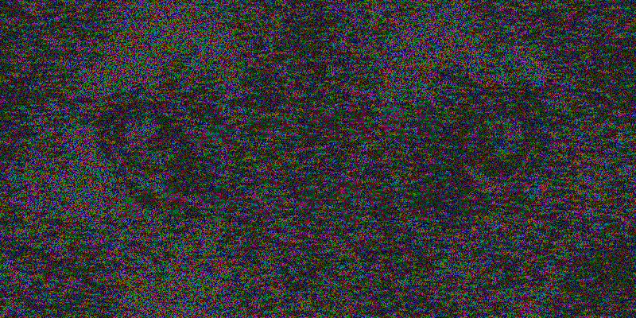

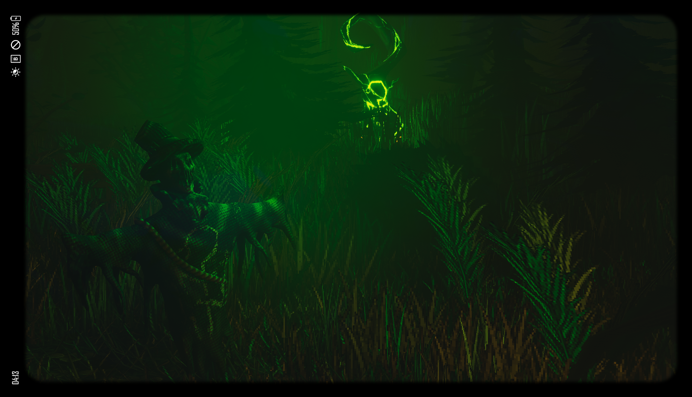

Editando a imagem do lobo, achamos alguns *Sigilos do Outro Lado*. Transcrevendo eles, conseguimos Aquele Sentimento, e traduzindo, tínhamos a frase `"AQUELE SENTIMENTO`".

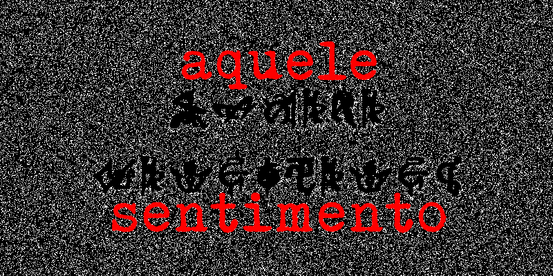

a outra imagem continha uma captura de tela, de um celular, da área externa da casa da Família Strach, com o nome "**sem_sinal.png**". editando a imagem e selecionando para ser mostrada apenas a camada de cor azul da imagem, descobrimos outra imagem escondida nela, tendo vários itens de exploração espalhados pelo chão e patas de um cachorro no topo. A lanterna, que iluminava o que parecia ser um diário no chão.

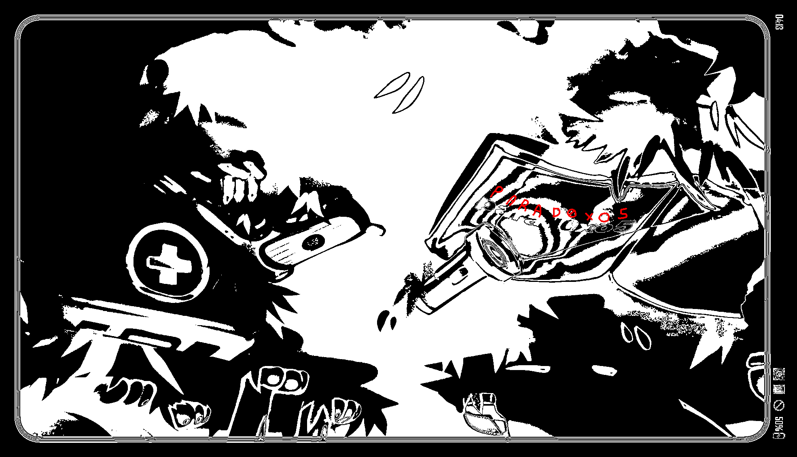

Podemos Enxergar `parad0xo5`(paradoxos) com isso podemos ir para o link novamente [https://oth3r.site/parad0xo5](https://oth3r.site/parad0xo5) somos redirecionados para um link do mega:[parad0xo5.rar](https://mega.nz/file/YZJjhLSY#1ctemb9O6FFR66Rw4xDcZTKCgK2BaGew1v3yk5WZnP4).

#### parad0xo5
Recebemos o arquivo: [parad0xo5.rar](./1_-_Mia_e_Verissimo/oth3rsite/parad0xo5.rar)

Novamente, o que nós tínhamos sobrando era "**aquelesentimento**". Usando como senha, acessamos mais arquivos novos, e novamente mais duas imagens. A primeira se chamava "exspecta at.png", sendo uma imagem de cores distorcidas com um olho no meio e ao fundo, as espirais de Morte, com alguns sigilos ao redor. A segunda se chamava "loop.png", sendo uma imagem de uma trilha com pegadas de cachorro, com objetos de personagens relacionados ao jogo, dois lagos no meio do caminho e o símbolo do Medo no centro do cenário.


A primeira imagem **exspecta at** cuja tradução é "`espera em`" tem um olho com alguns sigilos que traduzidos dão vis unita fortior, a mesma frase que vimos antes.


Isso da entender para aguardamos no Instagram para uma próxima parte, enquanto isso podemos olhar para imagem loop.png, nela podemos observar que algumas patinhas tem padrões diferentes, aqui encontramos códigos binários sendo 1 para quando existe dedo na pata e 0 quando não existe.


Temos o seguinte binário: 
```bash
00111110 01110011 01100101 01100101 00101110 01101111 01101111 01110100 01100001 01100010 00101110 01101101 01101001 01101110 01100100 00111100
```

Traduzindo este código para ASCII temos
"`>see.ootab.mind<`"
A frase traduzida pode ser lida como
**">está.esperando.por.mim<"** ou **">it.is.waiting.for.me<"**, vindo do estoniano. 

Guardamos essa informação e aguardamos no Instagram.
até as 2024-10-18T08:02:13.000Z tivemos a [postagem](https://www.instagram.com/p/DBQg_bpxIyI/) de uma imagem com algumas palavras em linhas e colunas.

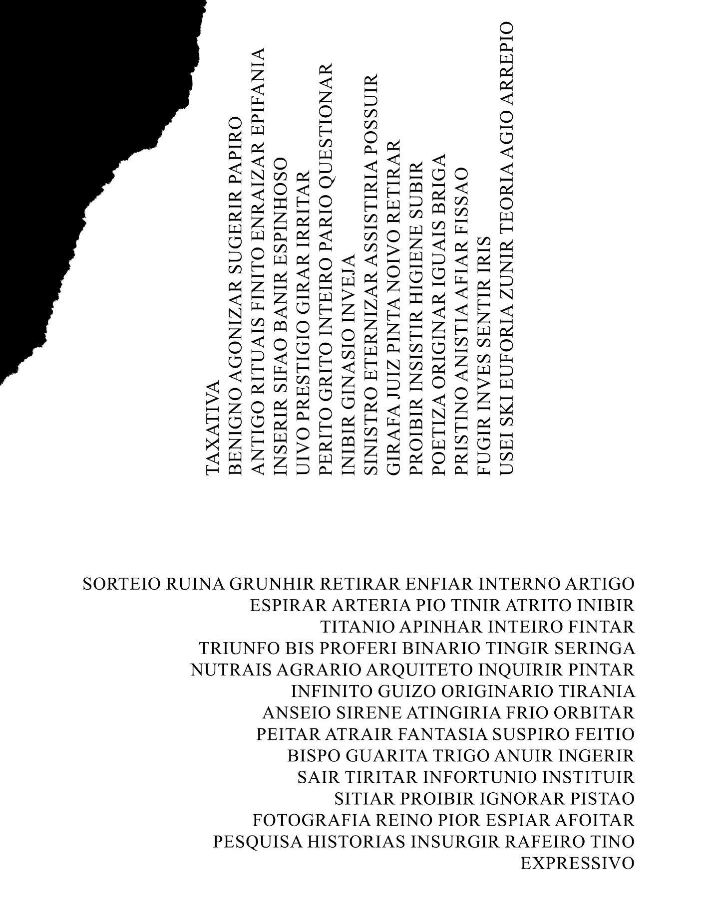

Para resolver esse caso tivemos que identificar primeiramente a posição onde o texto de baixo estava em linhas e alinhado a esquerda, o texto de cima estava em colunas e alinhado a esquerda também, isso é uma dica para criarmos uma espécie de tabela.
Após fazer isso identificamos que todas as palavras do texto tinham a letra "I" e todas em maiúsculo. Após alguns teste identificamos que na verdade deveríamos usar como numeral romano.
Após aplicar numeral romano podemos enxergar o que é um layout de Nonograma a pós aplicar regras desse jogo na imagem conseguimos ver um código DataMatrix.

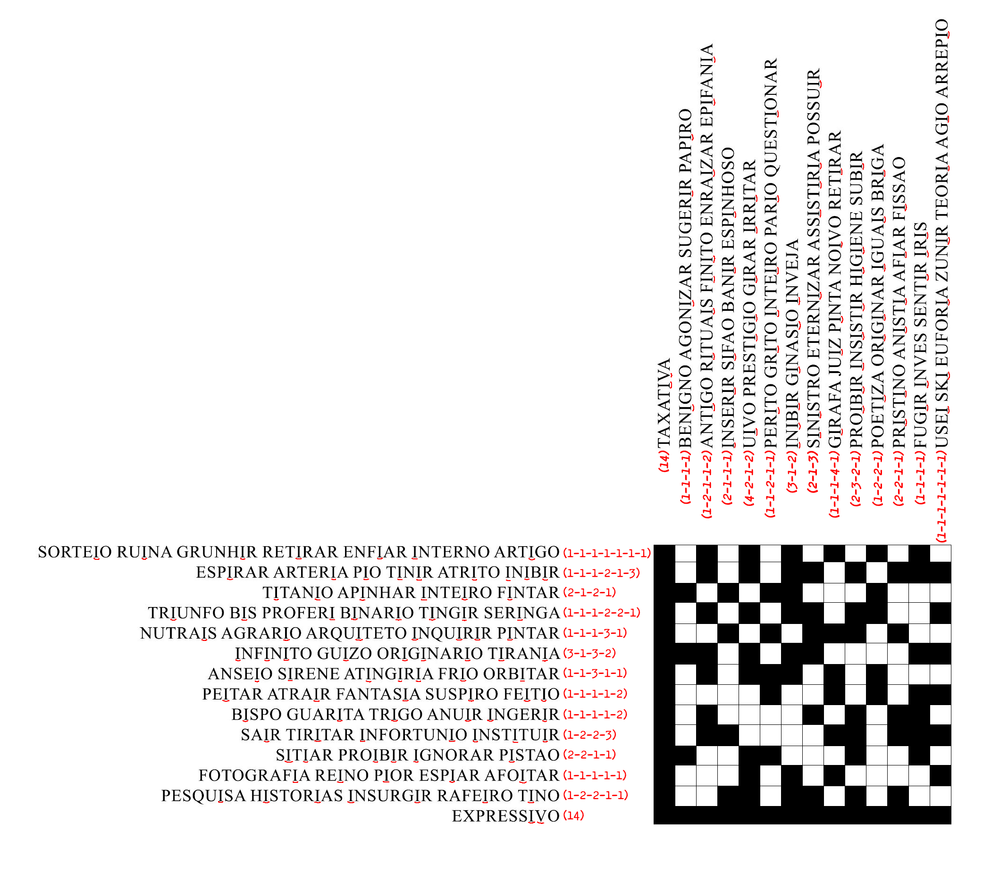

Formando o Nonograma, percebemos que o formato dele se assemelhava a um código de barras que tínhamos visto há um bom tempo: DataMatrix. Escaneando o código, finalmente tínhamos algo: a palavra "`viisil`". **Caminho**, em estoniano. Um novo caminho para nós.

#### vissil

Acessando [oth3r.site/viisil](oth3r.site/viisil), fomos redirecionados para mais um link do mega [10.mp3](https://mega.nz/file/5ZpkRABK#f5GB688QJdPaAC1Mj0MkJXGUDBiPC_USZf-epCZpFPY) parte do enigma, e dessa vez um áudio. O nome do áudio era ["10"](./1_-_Mia_e_Verissimo/oth3rsite/viisil/10.mp3), tendo exatamente dois minutos de duração, com o que pareciam ser passos de alguém, tanto do lado esquerdo quanto do lado direito.

Olhando nas propriedades do arquivo de áudio, percebemos que, nos comentários do áudio, havia a frase `"curvas sequere"`, que traduzida, nos indicava para **"seguir as curvas"**, Ficamos presos aqui!

Ás 23:35, a conta do Instagram novamente fez um [post](https://www.instagram.com/p/DBSf-XuONek/), e dessa vez sendo um "*reels*". Um vídeo da imagem "*loop*" em sequência, literalmente fazendo um loop de imagem, com a legenda "*curvas sequere*"; e isso nos indicou que as duas coisas eram para ser resolvidas juntas.[dica curvas sequere](./Redes/Instagram/v1s_un1ta_f0rt10r/curvas%20sequere.mp4)


https://github.com/user-attachments/assets/2cebd515-264b-43b7-a8f9-86e5c9ddb4e8

Mesmo sendo uma tarefa difícil, pensar que o título do áudio dizia fazer o mesmo loop 10 vezes foi uma boa sacada. E eventualmente, percebemos que sempre devíamos seguir as mesmas curvas em sequência: ESQUERDA - DIREITA - ESQUERDA. E toda vez que houvesse apenas um passo de um lado, nós contávamos 0. Porém, caso esse passo correspondesse ao lado da curva da sequência (exemplo: se o passo que ocorreu na direita correspondesse à curva da direita), nós contávamos 1. E por último, em caso dos dois passos ocorrerem ao mesmo tempo, também contávamos 1. Com isso, finalmente achamos o código binário que nos faria sair desse pesadelo sem fim.

```

Audio: D22D2222_22E_2_DE22EEDEDDE2E__EDD2D2D_E_ED2_2EDDD2E2ED22D22DEED2EEED EEDDDEDE2DDDDDDED22E22_2DE2DD2D222ED2DDD__EEEE_E22_DD2_D_DDD22EDEEEEDEEE22DD22DDDDEDED22_2D
LOOP:  EDEEDEEDEEDEEDEEDEEDEEDEEDEEDEEDEEDEEDEEDEEDEEDEEDEEDEEDEEDEEDEEDEEDEEDEEDEEDEEDEEDEEDEEDEEDEEDEEDEEDEEDEEDEEDEEDEEDEEDEEDEEDEEDEEDEEDEDEEDEEDEEDEEDEEDEEDEEDEED
BIN:   0110111101110100011010000011001101110010001011100111001101101001011101000110010100101111011010010110111001100001011011100110100101110011001011100110100001111010

```
#### inanis
Traduzindo o binário, chegamos em "`oth3r.site/inanis.hz`". O nosso próximo passo.

Acessando [oth3r.site/inanis.hz](oth3r.site/inanis.hz), somos apresentados a mais um .rar [inanis.rar](https://mega.nz/file/5ZpkRABK#f5GB688QJdPaAC1Mj0MkJXGUDBiPC_USZf-epCZpFPY) para baixar **inanis** temos uma palavra em latim que traduzido da `"Vazio"` . Usando aquele código das patinhas que pegamos anteriormente *">see.ootab.mind<"* como senha, temos acesso aos conteúdos desse .rar onde se encontra novamente de duas imagens: uma chamada "not_past.png", com vários números e um focinho de cachorro ou lobo mordendo a seção branca do meio; e a segunda chamada "tool.png", com vários pássaros em cima de cinco postes de luz.


De primeira, percebemos na imagem dos pássaros que alguns deles continham olhos coloridos. Contando todos, vimos que haviam:

* 5 pássaros com olhos vermelhos;
* 5 pássaros com olhos amarelos;
* 4 pássaros com olhos verdes;
* Os outros com olhos brancos.

Além disso, sabíamos que esses pássaros não eram só pássaros. E por estarem em cima de fios de postes, já sabíamos para onde ir: para a cifra `Birds on a Wire`. E com isso, checamos e rechecamos todos os pássaros até termos uma tabela de letras e cores completa.

Tendo as letras e cores, começamos a pensar no que elas iriam nos levar, separando os pássaros por níveis de poste, espécies de pássaros, mas nada. Até que subitamente, ao mesmo tempo em que resolvia junto com a comunidade em stream, o Matt teorizou sobre a particularidade do nome do arquivo "*tool.png*" que podia se relacionar com o pé de cabra que representava a Mia na imagem "*loop.png*". Procurando melhor sobre na imagem, percebemos que apesar de termos bastante pássaros, o visual deles se assemelhava muito a corvos. Corvo em inglês é "*crow*". Pé de cabra em inglês é "**crowbar**".

Com isso, tentamos ver se havia algo que pudesse nos ajudar com esses corvos, até o momento em que o próprio Matt percebeu que circulando alguns corvos específicos, formava a frase "`YOU ARE`". Essa frase sozinha não nos ajudava muito, até percebermos nos metadados da foto que havia uma descrição: "`1_2_`".


```
Aqui ainda falta usar alguns passaros?
```

Associando isso com a nossa frase, acessando [https://oth3r.site/you_are_](https://oth3r.site/you_are_), chegamos vamos para o [mega](https://mega.nz/file/kcBjjK4L#PfeD7mG6mz4tih1vitr2P4I6mGddH1EpMbIOueLXRQI) a um novo arquivo [you_are_](./1_-_Mia_e_Verissimo/oth3rsite/you_are_.rar) , e mais um com senha.


Enquanto isso, na imagem dos números e o focinho, tivemos a ideia de realmente contar a quantidade dos números do meio. Por exemplo, tendo o número **4444444**, contamos que haviam sete números quatro. E isso equivalia a **74**. Fazendo todo o processo, tínhamos `"74 72 69 61 64 61 614 20 73 68 69 66 74"`.


Olhando os números, já tínhamos ideia de que esse era um código hexadecimal, porém o número 614 não fazia sentido. Entretanto, sabíamos que além de números, códigos hexadecimais continham letras. E justamente o 14, que era único nessa imagem, era considerado a letra E em hexadecimal. E com isso, traduzindo de maneira certa, conseguimos as palavras "Triadan Shift".

Basicamente Triadan nos levava ao sistema de arcada dentária de vários animais. E é claro, fomos focar na arcada dentária de um cachorro. Entretanto, nenhuma das informações dadas pela imagem batia com o que tínhamos de informação sobre as numerações que cada dente recebia. Por isso, ficamos bastante tempo apenas pensando em como associar essas informações. Passamos a madrugada, chegamos no terceiro dia, e, com isso, uma nova dica.


A conta do Instagram mais uma vez fez um [post](https://www.instagram.com/p/DBUBDM-Oqng/), representando a imagem do not_past com algumas palavras em cima dos valores: Triadan invertida em cima e SHIFT dos dois lados, além da legenda "`65 83 67 73 73`". Essa legenda, decodificada em código **ASCII**, ironicamente, nos dava a palavra "**ASCII**".

Ou seja, alguma coisa de ASCII estava relacionada com os números dos dois lados: 
<center>
"56 67 236 210 207 218 62 51 55 204 137 215 52 47 44 202". 
</center>

No meio de nossa procura mediante essas dicas, finalmente achamos a luz no fim do túnel: ASCII Shift Cipher. Usando ela e alternando as trocas de letra/shifts na ordem inversa, de acordo com o sistema Triadan da arcada dentária do cachorro (203 202 201 101 102 103), tínhamos a resposta: ""my#missing#piece".

A dica **not_past** provavelmente seria para que não considerássemos os dentes de leite.


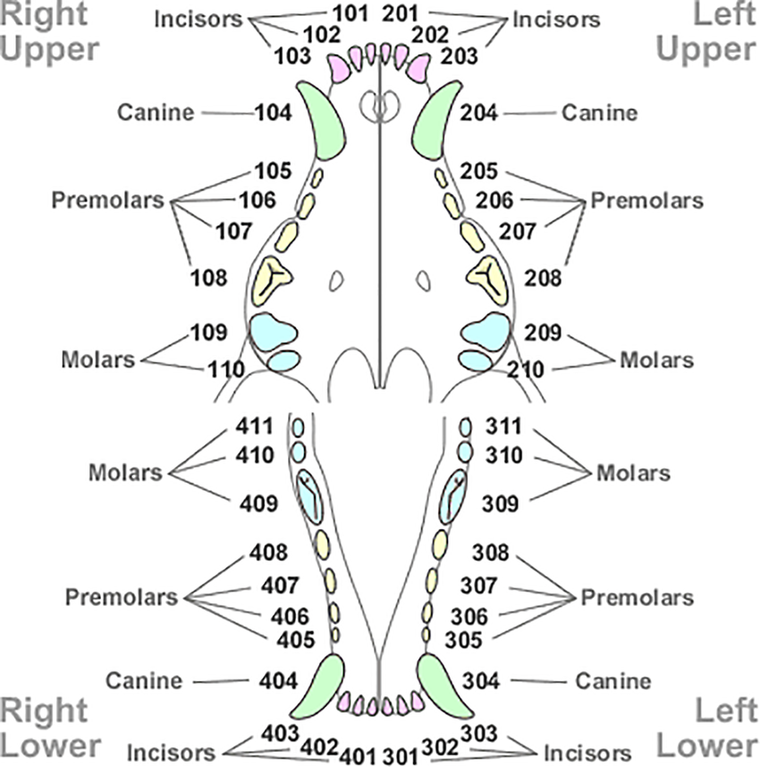

O complemento do nosso outro .rar: `you_are_my#missing#piece`.

Usando **my#missing#piece** como senha para o you_are_.rar, conseguimos extrair o arquivo de dentro.

#### you_are_

Acessando o arquivo presente no .rar, vimos que o nome dele era ["RMG.z64"](./1_-_Mia_e_Verissimo/oth3rsite/you_are_/RMG.z64). Na mesma hora que vimos a extensão do arquivo, já era óbvio: iríamos fazer uma emulação de um jogo de Nintendo 64.

Obviamente, nem todos os emuladores conseguiam emular o nosso arquivo. Porém, a dica do nome dele nos entregou o único que realmente funcionava: RMG. E abrindo o jogo nesse emulador...

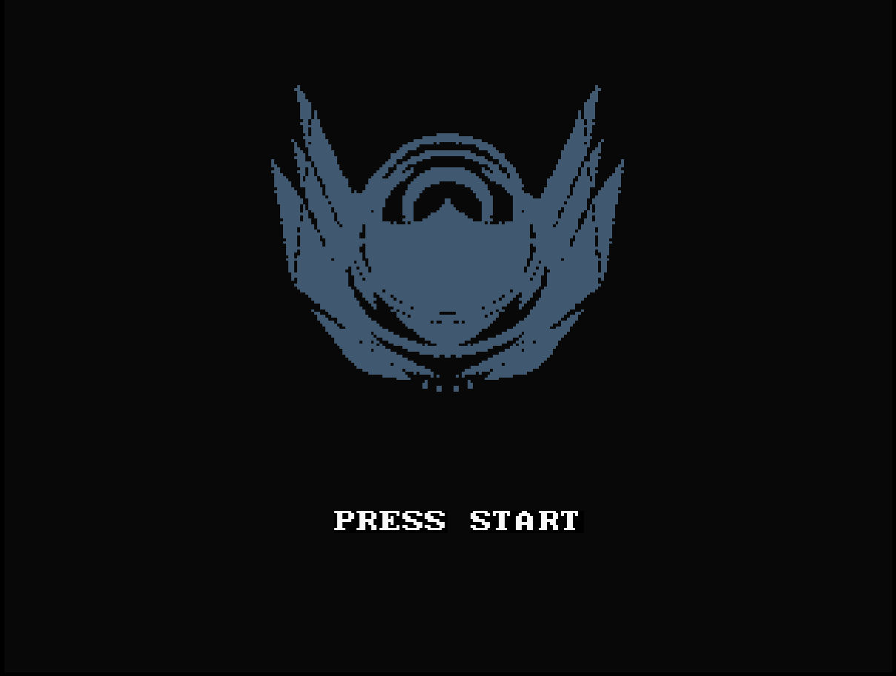

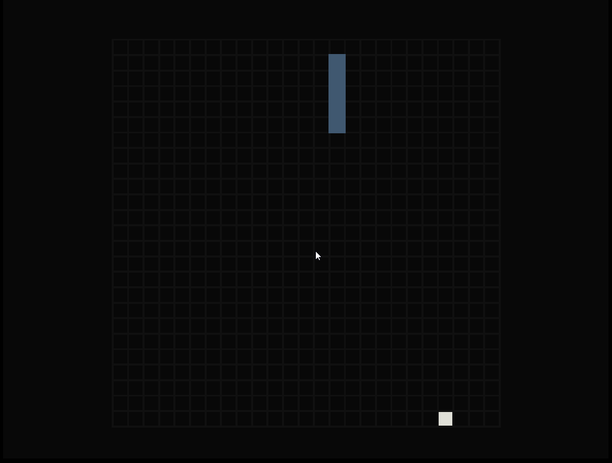

Basicamente, tínhamos o **"Jogo da Cobrinha"**. Parecia até um jogo normal, de movimentar a cobrinha e ir em direção ao ponto branco (ou a maçã). Porém, toda vez que nós "comíamos a maçã", sempre havia um áudio, aparentemente significando que havíamos comido ela. Mas, depois, fomos procurar dentro do jogo e vimos que haviam diversos áudios separados. Juntando todos eles, tínhamos uma voz robotizada falando a frase `"THE GOD OF FEAR IS WATCHING"`, uma referência a famosa frase do trailer de Enigma do Medo, de que *"O DEUS DO MEDO ESTÁ OBERVANDO"*, além disso podemos observar que o nome do jogo é `T.G.O.F.I.W` esse audio ao completador o jogo inteiro se reproduz 5 vezes.

[THE GOD OF FEAR IS WATCHING](./1_-_Mia_e_Verissimo/oth3rsite/you_are_/CobrinhaFullEdit.wav)


Enquanto jogávamos, percebemos que cada "maçã" que comíamos aparecia em espaços pré-definidos e alternados, e tendo como base o fato de que o grid onde estávamos jogando era feito de **25x25** pixels, pensamos em montar um código **QR** com os pixels. E ao chegar no fim do jogo, a frase `"Follow the White Rabbit"` aparecia, o que implicava que tínhamos que seguir o pixel branco e ele nos daria a resposta.

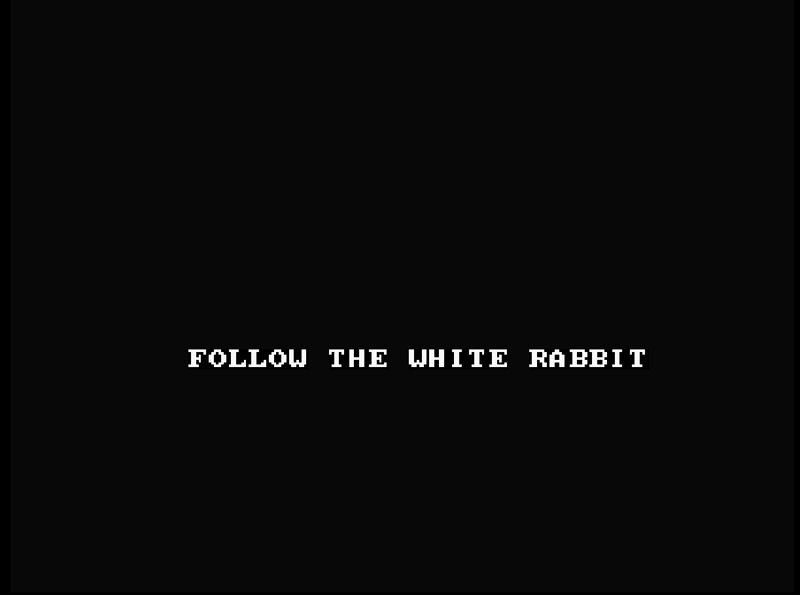

E com isso, a comunidade se prontificou tanto a jogar como também a mapear o **QR Code**. Diversas pessoas mandavam suas coordenadas enquanto outras faziam a montagem desse código. Eventualmente, depois de vários códigos QRs errados, finalmente achamos um que era reconhecido e nos dava uma informação.


#### erimia_

Escaneando o QR Code, ele nos devolvia o link [oth3r.site/erimia_](oth3r.site/erimia_). erimia que do latim podemos traduzir para solidão ou "deserto espiritual". E mais uma vez, tínhamos um arquivo no [MEGA](https://mega.nz/file/bUpjRDqS#pN6VP24I4eoIfUdgX9m4-XLc1__s0YETxlXTNGs-vbY), mas agora uma imagem. E uma bem especial.


A imagem que tínhamos era uma arte de Mia e Lupi. O curioso é que já havíamos visto essa arte antes.


Analisando a imagem, percebemos que já tínhamos passado por ela quando resolvemos o enigma do parad0xo5 e que a foto de perfil das contas **v1s_un1ta_f0rt10r** eram o espantalho presente nessa arte. Mas acima de tudo, ela também era a arte do pôster recebido pela Bagi no leilão de caridade produzido pelo [**CDawgVA**](https://youtu.be/_G342BIPut8?t=21428), feita pelo artista colombiano da comunidade, *Torrente*.

Mas agora, a imagem tinha suas diferenças. O diário, que antes tinha **"parad0xo5"** escrito, e que, na arte original, continha a assinatura do Cellbit, agora tinha vários símbolos de dados e uma anotação sobre o Perímetro, além de uma peça de quebra-cabeça solta. Procurando por cifras relacionadas a dados ou até mesmo a quebra-cabeças, não tivemos sucesso, pois elas não combinavam com os símbolos que tínhamos. Entretanto, algo bem peculiar nos chamou a atenção.

Ao usarmos um alfabeto de adagas, vimos que a maioria dos símbolos, mesmo que forçadamente, se encaixavam no design de como foi feito.

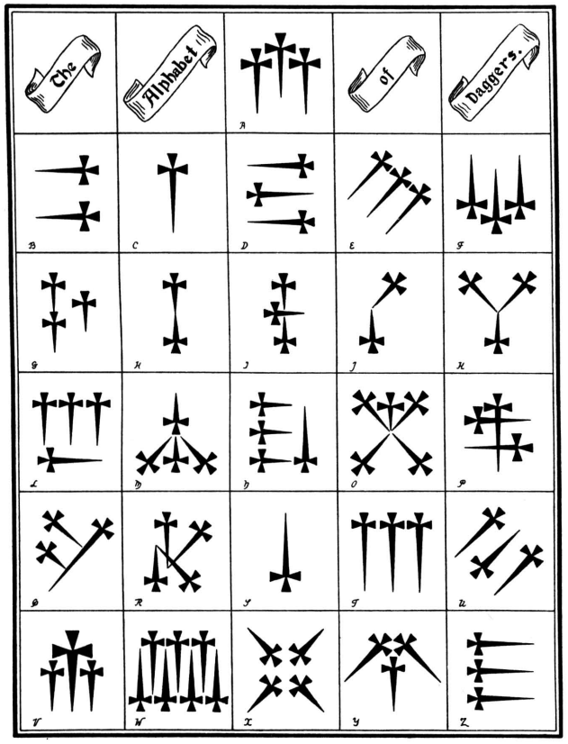

E surpreendentemente, após traduzidos, as letras formavam uma frase certa. Com isso, tínhamos a frase "NON MEMINIT", algo que parecia vir do latim, e que, quando traduzida, nos dava a frase "Ele não se lembra".

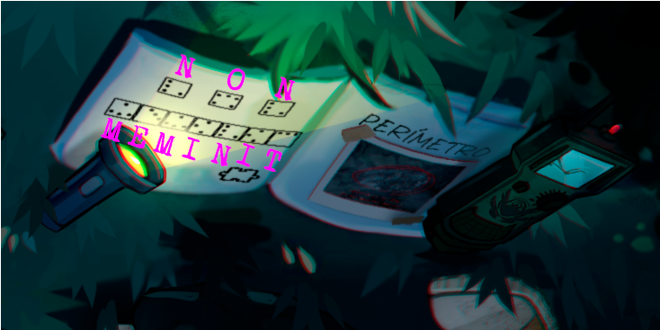

<center>
Por ter uma peça de quebra-cabeça solta acreditamos que essa parte 1 do enigma foi finalizada e utilizaremos o que pegamos aqui mais para frente ou até no final do enigma
</center>

## Agatha Volkomenn

No quinto dia, e novamente às **16:13**, dessa vez a conta da [Dumativa no Twitter postou](https://x.com/dumativa/status/1848442416069845086/photo/1) uma imagem, no que parecia ser a visão da noite, com algumas estrelas e a lua no céu, pela janela de um quarto, com algumas roupas em cima de uma cadeira.

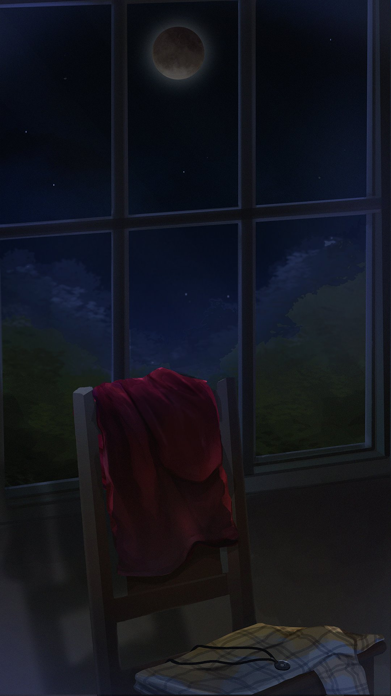

Depois de fazer várias edições na imagem, não encontramos nada que poderia ser relevante para a continuação do enigma. Porém, identificamos as roupas que estavam em cima da cadeira como as roupas de Agatha Volkomenn: sua blusa vermelha, seu colar e a camisa que ela usa amarrada na cintura. Por saber disso, inferimos que a partir desse momento, os próximos enigmas teriam relação com Agatha, seguindo o caminho da imagem "loop", em que os primeiros enigmas eram sobre Mia e Lupi.

Pouco mais tarde, a conta de [Ordem Paranormal no BlueSky](https://bsky.app/profile/ordemparanormal.com.br/post/3l72mdw77ug2q) postou mais uma arte, dessa vez o que aparentava ser o quarto de Agatha, com vários post-its e desenhos colados na parede, um espelho de mesa refletindo uma janela com a lua à mostra, vários livros e anotações na mesa e o brinco de pena de Agatha. Referências como Shadow da franquia Sonic e a banda Babymetal também aparecem, reforçando ainda mais que a arte tem relação com ela.
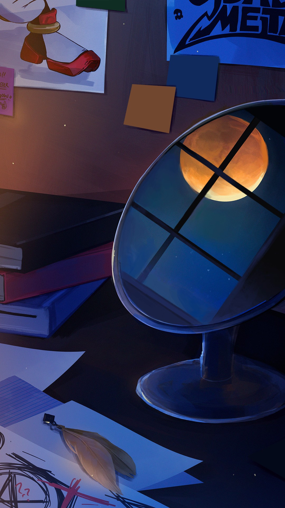

No Dia 22 Tivemos uma nova atualização agora no [threads](https://www.threads.net/@ordemparanormal/post/DBbn2oGPXyy), aparenta ser a Agatha, Ele aparenta estar sentando em uma janela olhando a lua.

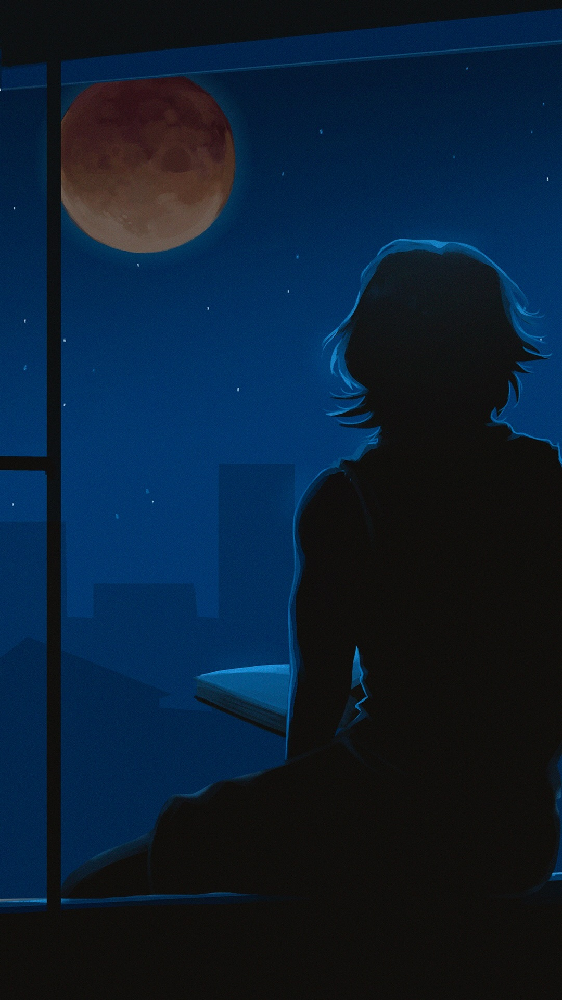


