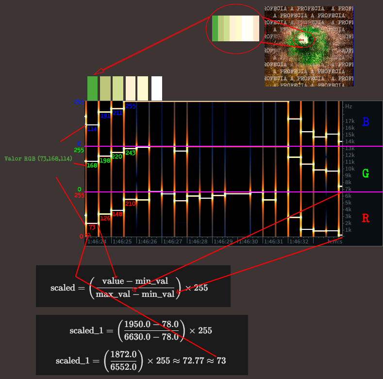

# ARG - ENIGMA DO MEDO
O ARG de Enigma do Medo é um evento especial realizado nas redes sociais de Ordem Paranormal que teve seu início no dia *17 de outubro de 2024*. Esse jogo de realidade alternativa foi feito com o objetivo de apresentar várias informações, aspectos e temáticas acerca de Enigma do Medo, sendo abaixo documentado na ordem de suas respectivas resoluções.

Início
No dia *17 de outubro de 2024*, no aniversário de quatro anos do anúncio de Enigma do Medo, às **16h13** (referenciando a sequência **0413**), foi postado uma [imagem](https://x.com/OrdemParanormal/status/1846992828196692220/photo/1) nas redes sociais oficiais de Ordem Paranormal, com vários itens espalhados como diversos papéis sobre uma mesa e uma lanterna UV junto ao símbolo do Medo ao centro formado por recortes das folhas. Nos documentos, podem ser identificados algumas menções e referências ao jogo:
<center>

Ele retornará;

Ele está observando;

Entre em contato - DESAPARECIDO;

TUDO precisa estar pronto;

Quatro anos, quatro anos, quatro anos...

O dia está chegando, o dia está chegando, o dia
 
está chegando...

Todas as histórias precisam ser contadas um dia.
</center>


Logo após a publicação misteriosa, foram adicionadas novas imagens codificadas nas páginas oficiais de Enigma do Medo na [Steam](https://shared.fastly.steamstatic.com/store_item_assets/steam/apps/1507580/extras/cima.png?t=1729193582) e na [Nuuvem](https://www.nuuvem.com/lp/pt/enigma-do-medo/images/baixo.png) na estrutura textual do site. Cada uma das plataformas estava mencionada na foto misteriosa, com o ID do jogo na Steam à mostra em um papel pequeno (**1507580**), e o logotipo da Nuuvem sendo mostrado pela lanterna UV.


## 1 - Mia e Verissímo.
Essas imagens faziam parte da arte comemorativa postada nas redes sociais de Ordem Paranormal durante o Natal de 2022, onde Mia e o Senhor Veríssimo estão presentes.


Ao unir as duas imagens e rotacionar *90°* em sentido horário, descobrimos uma série de caracteres escondida em meio aos recortes das fotos: `GX266lL9HcE`. Usando esses caracteres como se fossem um link de um vídeo do YouTube, chegamos a próxima parte.


### Youtube
https://www.youtube.com/watch?v=GX266lL9HcE


https://github.com/user-attachments/assets/93fe9d19-30f2-4823-b50c-25aac1de0567


#### Informações
* Nome do video: ?
* Nome do canal: v1s_un1ta_f0rt10r
* Nome do canal está em leetcode.
Ou seja algumas letras foram trocadas por números.

A tradução fica em latim de **Vis Unita Fortior** significa *"Unidos Venceremos"*.

O vídeo que tínhamos achado continha Mia segurando e piscando uma lanterna UV contra uma parede com desenhos de adultos e crianças que aparecem alternadamente, junto de Lupi latindo e rosnando ao fundo.

Fazendo relação com "O Deus do Medo está observando".
Ela está aflita e respirando fundo.

Interpretando a figura adulta como um risco e a figura criança como um ponto, começamos a decodificar um Código Morse:
```bash
.- .-.. . .- -....- .. .- -.-. - .- -....- . ... - 
```

Tradução para o Morse: `ALEA-IACTA-EST` (Uma frase em latim que significa "*o dado foi lançado*")

Além disso nesse video podemos ouvir um cachorro latindo.
Temos que pegar o momento que que a lanterna está acessa e os latidos do cachorro sendo
rosnado sendo risco e latido igual a ponto. Com isso, conseguimos:
```bash
-- .- ..- ...- .- .. ... .--. .-. . ... .- --. . 
```

Traduzindo temos: `mauvaispresage` (Uma palavra em Francês que significa '*Mau Presságio*')

Se olharmos bem a forma como a lanterna ascende num formato que parece ser o Instagram.

### Instagram


Indo para o Instagram procuramos pelas frases e mensagens que temos.

Encontramos a conta do `v1s_un1ta_f0rt10r` no [Instagram](https://www.instagram.com/v1s_un1ta_f0rt10r)

Essa conta possuía uma foto de perfil que parece ser o espantalho do jogo.


Acessando o Instagram, vimos que 13 horas antes do enigma começar, a conta havia postado diversos [stories](https://www.instagram.com/stories/highlights/18027647033147850/), sendo uma sequência de imagens alternadas entre preto e branco.

Basicamente nesse story temos:
* Preto atraso muito longo temos "-"
* Preto com atraso curto temos "."
* Branco com atraso rápido temos " "

Juntando todos os stories temos um código morse novamente.

```bash
--- - .... ...-- .-. .-.-.- ... .. - . -..-.
```
### Oth3r Site

O resultado desse morse é [oth3r site](https://oth3r.site)

Ao acessar esse site você é direcionado para a página da steam do jogo [Steam](https://store.steampowered.com/app/1507580/).

Porém ao colocar 
**ALEA-IACTA-EST** no final do link [https://oth3r.site/ALEA-IACTA-EST](https://oth3r.site/ALEA-IACTA-EST) somos redirecionados para um link do mega:
[aleiactaest](https://mega.nz/file/RRAESJYA#X6MzrpBgvoEcnBcduMgbaC2e-cb7ETyFHw0gMN6xrmU).

#### aleiactaest
Recebemos o arquivo
[aleiactaest.rar](1_-_Mia_e_Lupi/oth3rsite/aleaiactaest.rar)

O RAR tinha senha, e a única coisa que havia sobrado para nós era **"mauvais presage"**. Usando essa expressão como senha, conseguirmos extrair os arquivos presentes no arquivo .rar, sendo esses arquivos duas imagens.


Editando a imagem do lobo, achamos alguns *Sigilos do Outro Lado*. Transcrevendo eles, conseguimos Aquele Sentimento, e traduzindo, tínhamos a frase `"AQUELE SENTIMENTO`".


a outra imagem continha uma captura de tela, de um celular, da área externa da casa da Família Strach, com o nome "**sem_sinal.png**". editando a imagem e selecionando para ser mostrada apenas a camada de cor azul da imagem, descobrimos outra imagem escondida nela, tendo vários itens de exploração espalhados pelo chão e patas de um cachorro no topo. A lanterna, que iluminava o que parecia ser um diário no chão.


Podemos Enxergar `parad0xo5`(paradoxos) com isso podemos ir para o link novamente [https://oth3r.site/parad0xo5](https://oth3r.site/parad0xo5) somos redirecionados para um link do mega:[parad0xo5.rar](https://mega.nz/file/YZJjhLSY#1ctemb9O6FFR66Rw4xDcZTKCgK2BaGew1v3yk5WZnP4).

#### parad0xo5
Recebemos o arquivo: [parad0xo5.rar](./1_-_Mia_e_Lupi/oth3rsite/parad0xo5.rar)

Novamente, o que nós tínhamos sobrando era "**aquelesentimento**". Usando como senha, acessamos mais arquivos novos, e novamente mais duas imagens. A primeira se chamava "exspecta at.png", sendo uma imagem de cores distorcidas com um olho no meio e ao fundo, as espirais de Morte, com alguns sigilos ao redor. A segunda se chamava "loop.png", sendo uma imagem de uma trilha com pegadas de cachorro, com objetos de personagens relacionados ao jogo, dois lagos no meio do caminho e o símbolo do Medo no centro do cenário.


A primeira imagem **exspecta at** cuja tradução é "`espera em`" tem um olho com alguns sigilos que traduzidos dão vis unita fortior, a mesma frase que vimos antes.


Isso da entender para aguardamos no Instagram para uma próxima parte, enquanto isso podemos olhar para imagem loop.png, nela podemos observar que algumas patinhas tem padrões diferentes, aqui encontramos códigos binários sendo 1 para quando existe dedo na pata e 0 quando não existe.


Temos o seguinte binário: 
```bash
00111110 01110011 01100101 01100101 00101110 01101111 01101111 01110100 01100001 01100010 00101110 01101101 01101001 01101110 01100100 00111100
```

Traduzindo este código para ASCII temos
"`>see.ootab.mind<`"
A frase traduzida pode ser lida como
**">está.esperando.por.mim<"** ou **">it.is.waiting.for.me<"**, vindo do estoniano. 

Guardamos essa informação e aguardamos no Instagram.
até as 2024-10-18T08:02:13.000Z tivemos a [postagem](https://www.instagram.com/p/DBQg_bpxIyI/) de uma imagem com algumas palavras em linhas e colunas.


Para resolver esse caso tivemos que identificar primeiramente a posição onde o texto de baixo estava em linhas e alinhado a esquerda, o texto de cima estava em colunas e alinhado a esquerda também, isso é uma dica para criarmos uma espécie de tabela.
Após fazer isso identificamos que todas as palavras do texto tinham a letra "I" e todas em maiúsculo. Após alguns teste identificamos que na verdade deveríamos usar como numeral romano.
Após aplicar numeral romano podemos enxergar o que é um layout de Nonograma a pós aplicar regras desse jogo na imagem conseguimos ver um código DataMatrix.


Formando o Nonograma, percebemos que o formato dele se assemelhava a um código de barras que tínhamos visto há um bom tempo: DataMatrix. Escaneando o código, finalmente tínhamos algo: a palavra "`viisil`". **Caminho**, em estoniano. Um novo caminho para nós.

#### vissil

Acessando [https://oth3r.site/viisil](https://oth3r.site/viisil), fomos redirecionados para mais um link do mega [10.mp3](https://mega.nz/file/5ZpkRABK#f5GB688QJdPaAC1Mj0MkJXGUDBiPC_USZf-epCZpFPY) parte do enigma, e dessa vez um áudio. O nome do áudio era ["10"](./1_-_Mia_e_Lupi/oth3rsite/viisil/10.mp3), tendo exatamente dois minutos de duração, com o que pareciam ser passos de alguém, tanto do lado esquerdo quanto do lado direito.


https://github.com/user-attachments/assets/44e26cfd-e123-4d30-80c6-4554b69f61d3


Olhando nas propriedades do arquivo de áudio, percebemos que, nos comentários do áudio, havia a frase `"curvas sequere"`, que traduzida, nos indicava para **"seguir as curvas"**, Ficamos presos aqui!

Ás 23:35, a conta do Instagram novamente fez um [post](https://www.instagram.com/p/DBSf-XuONek/), e dessa vez sendo um "*reels*". Um vídeo da imagem "*loop*" em sequência, literalmente fazendo um loop de imagem, com a legenda "*curvas sequere*"; e isso nos indicou que as duas coisas eram para ser resolvidas juntas.[dica curvas sequere](./Redes/Instagram/v1s_un1ta_f0rt10r/curvas%20sequere.mp4)


https://github.com/user-attachments/assets/2cebd515-264b-43b7-a8f9-86e5c9ddb4e8

Mesmo sendo uma tarefa difícil, pensar que o título do áudio dizia fazer o mesmo loop 10 vezes foi uma boa sacada. E eventualmente, percebemos que sempre devíamos seguir as mesmas curvas em sequência: ESQUERDA - DIREITA - ESQUERDA. E toda vez que houvesse apenas um passo de um lado, nós contávamos 0. Porém, caso esse passo correspondesse ao lado da curva da sequência (exemplo: se o passo que ocorreu na direita correspondesse à curva da direita), nós contávamos 1. E por último, em caso dos dois passos ocorrerem ao mesmo tempo, também contávamos 1. Com isso, finalmente achamos o código binário que nos faria sair desse pesadelo sem fim.

```

Audio: D22D2222_22E_2_DE22EEDEDDE2E__EDD2D2D_E_ED2_2EDDD2E2ED22D22DEED2EEED EEDDDEDE2DDDDDDED22E22_2DE2DD2D222ED2DDD__EEEE_E22_DD2_D_DDD22EDEEEEDEEE22DD22DDDDEDED22_2D
LOOP:  EDEEDEEDEEDEEDEEDEEDEEDEEDEEDEEDEEDEEDEEDEEDEEDEEDEEDEEDEEDEEDEEDEEDEEDEEDEEDEEDEEDEEDEEDEEDEEDEEDEEDEEDEEDEEDEEDEEDEEDEEDEEDEEDEEDEEDEDEEDEEDEEDEEDEEDEEDEEDEED
BIN:   0110111101110100011010000011001101110010001011100111001101101001011101000110010100101111011010010110111001100001011011100110100101110011001011100110100001111010

```
#### inanis
Traduzindo o binário, chegamos em "`https://oth3r.site/inanis.hz`". O nosso próximo passo.

Acessando [https://oth3r.site/inanis.hz](https://oth3r.site/inanis.hz), somos apresentados a mais um .rar [inanis.rar](https://mega.nz/file/5ZpkRABK#f5GB688QJdPaAC1Mj0MkJXGUDBiPC_USZf-epCZpFPY) para baixar **inanis** temos uma palavra em latim que traduzido da `"Vazio"` . Usando aquele código das patinhas que pegamos anteriormente *">see.ootab.mind<"* como senha, temos acesso aos conteúdos desse .rar onde se encontra novamente de duas imagens: uma chamada "not_past.png", com vários números e um focinho de cachorro ou lobo mordendo a seção branca do meio; e a segunda chamada "tool.png", com vários pássaros em cima de cinco postes de luz.


De primeira, percebemos na imagem dos pássaros que alguns deles continham olhos coloridos. Contando todos, vimos que haviam:

* 5 pássaros com olhos vermelhos;
* 5 pássaros com olhos amarelos;
* 4 pássaros com olhos verdes;
* Os outros com olhos brancos.

Além disso, sabíamos que esses pássaros não eram só pássaros. E por estarem em cima de fios de postes, já sabíamos para onde ir: para a cifra `Birds on a Wire`. E com isso, checamos e rechecamos todos os pássaros até termos uma tabela de letras e cores completa.

Tendo as letras e cores, começamos a pensar no que elas iriam nos levar, separando os pássaros por níveis de poste, espécies de pássaros, mas nada. Até que subitamente, ao mesmo tempo em que resolvia junto com a comunidade em stream, o Matt teorizou sobre a particularidade do nome do arquivo "*tool.png*" que podia se relacionar com o pé de cabra que representava a Mia na imagem "*loop.png*". Procurando melhor sobre na imagem, percebemos que apesar de termos bastante pássaros, o visual deles se assemelhava muito a corvos. Corvo em inglês é "*crow*". Pé de cabra em inglês é "**crowbar**".

Com isso, tentamos ver se havia algo que pudesse nos ajudar com esses corvos, até o momento em que o próprio Matt percebeu que circulando alguns corvos específicos, formava a frase "`YOU ARE`". Essa frase sozinha não nos ajudava muito, até percebermos nos metadados da foto que havia uma descrição: "`1_2_`".


```
Aqui ainda falta usar alguns passaros?
```

Associando isso com a nossa frase, acessando [https://oth3r.site/you_are_](https://oth3r.site/you_are_), chegamos vamos para o [mega](https://mega.nz/file/kcBjjK4L#PfeD7mG6mz4tih1vitr2P4I6mGddH1EpMbIOueLXRQI) a um novo arquivo [you_are_](./1_-_Mia_e_Lupi/oth3rsite/you_are_.rar) , e mais um com senha.


Enquanto isso, na imagem dos números e o focinho, tivemos a ideia de realmente contar a quantidade dos números do meio. Por exemplo, tendo o número **4444444**, contamos que haviam sete números quatro. E isso equivalia a **74**. Fazendo todo o processo, tínhamos `"74 72 69 61 64 61 614 20 73 68 69 66 74"`.


Olhando os números, já tínhamos ideia de que esse era um código hexadecimal, porém o número 614 não fazia sentido. Entretanto, sabíamos que além de números, códigos hexadecimais continham letras. E justamente o 14, que era único nessa imagem, era considerado a letra E em hexadecimal. E com isso, traduzindo de maneira certa, conseguimos as palavras "Triadan Shift".

Basicamente Triadan nos levava ao sistema de arcada dentária de vários animais. E é claro, fomos focar na arcada dentária de um cachorro. Entretanto, nenhuma das informações dadas pela imagem batia com o que tínhamos de informação sobre as numerações que cada dente recebia. Por isso, ficamos bastante tempo apenas pensando em como associar essas informações. Passamos a madrugada, chegamos no terceiro dia, e, com isso, uma nova dica.


A conta do Instagram mais uma vez fez um [post](https://www.instagram.com/p/DBUBDM-Oqng/), representando a imagem do not_past com algumas palavras em cima dos valores: Triadan invertida em cima e SHIFT dos dois lados, além da legenda "`65 83 67 73 73`". Essa legenda, decodificada em código **ASCII**, ironicamente, nos dava a palavra "**ASCII**".

Ou seja, alguma coisa de ASCII estava relacionada com os números dos dois lados: 
<center>
"56 67 236 210 207 218 62 51 55 204 137 215 52 47 44 202". 
</center>

No meio de nossa procura mediante essas dicas, finalmente achamos a luz no fim do túnel: ASCII Shift Cipher. Usando ela e alternando as trocas de letra/shifts na ordem inversa, de acordo com o sistema Triadan da arcada dentária do cachorro (203 202 201 101 102 103), tínhamos a resposta: ""my#missing#piece".

A dica **not_past** provavelmente seria para que não considerássemos os dentes de leite.


O complemento do nosso outro .rar: `you_are_my#missing#piece`.

Usando **my#missing#piece** como senha para o you_are_.rar, conseguimos extrair o arquivo de dentro.

#### you_are_

Acessando o arquivo presente no .rar, vimos que o nome dele era ["RMG.z64"](./1_-_Mia_e_Lupi/oth3rsite/you_are_/RMG.z64). Na mesma hora que vimos a extensão do arquivo, já era óbvio: iríamos fazer uma emulação de um jogo de Nintendo 64.

Obviamente, nem todos os emuladores conseguiam emular o nosso arquivo. Porém, a dica do nome dele nos entregou o único que realmente funcionava: RMG. E abrindo o jogo nesse emulador...


Basicamente, tínhamos o **"Jogo da Cobrinha"**. Parecia até um jogo normal, de movimentar a cobrinha e ir em direção ao ponto branco (ou a maçã). Porém, toda vez que nós "comíamos a maçã", sempre havia um áudio, aparentemente significando que havíamos comido ela. Mas, depois, fomos procurar dentro do jogo e vimos que haviam diversos áudios separados. Juntando todos eles, tínhamos uma voz robotizada falando a frase `"THE GOD OF FEAR IS WATCHING"`, uma referência a famosa frase do trailer de Enigma do Medo, de que *"O DEUS DO MEDO ESTÁ OBERVANDO"*, além disso podemos observar que o nome do jogo é `T.G.O.F.I.W` esse audio ao completador o jogo inteiro se reproduz 5 vezes.

[THE GOD OF FEAR IS WATCHING](./1_-_Mia_e_Lupi/oth3rsite/you_are_/CobrinhaFullEdit.wav)


https://github.com/user-attachments/assets/a39fdd8b-85f7-4366-8f56-0e62d4167f3b


Enquanto jogávamos, percebemos que cada "maçã" que comíamos aparecia em espaços pré-definidos e alternados, e tendo como base o fato de que o grid onde estávamos jogando era feito de **25x25** pixels, pensamos em montar um código **QR** com os pixels. E ao chegar no fim do jogo, a frase `"Follow the White Rabbit"` aparecia, o que implicava que tínhamos que seguir o pixel branco e ele nos daria a resposta.


E com isso, a comunidade se prontificou tanto a jogar como também a mapear o **QR Code**. Diversas pessoas mandavam suas coordenadas enquanto outras faziam a montagem desse código. Eventualmente, depois de vários códigos QRs errados, finalmente achamos um que era reconhecido e nos dava uma informação.


#### erimia_

Escaneando o QR Code, ele nos devolvia o link [https://oth3r.site/erimia_](https://oth3r.site/erimia_). erimia que do latim podemos traduzir para solidão ou "deserto espiritual". E mais uma vez, tínhamos um arquivo no [MEGA](https://mega.nz/file/bUpjRDqS#pN6VP24I4eoIfUdgX9m4-XLc1__s0YETxlXTNGs-vbY), mas agora uma imagem. E uma bem especial.


A imagem que tínhamos era uma arte de Mia e Lupi. O curioso é que já havíamos visto essa arte antes.


Analisando a imagem, percebemos que já tínhamos passado por ela quando resolvemos o enigma do parad0xo5 e que a foto de perfil das contas **v1s_un1ta_f0rt10r** eram o espantalho presente nessa arte. Mas acima de tudo, ela também era a arte do pôster recebido pela Bagi no leilão de caridade produzido pelo [**CDawgVA**](https://youtu.be/_G342BIPut8?t=21428), feita pelo artista colombiano da comunidade, *Torrente*.

Mas agora, a imagem tinha suas diferenças. O diário, que antes tinha **"parad0xo5"** escrito, e que, na arte original, continha a assinatura do Cellbit, agora tinha vários símbolos de dados e uma anotação sobre o Perímetro, além de uma peça de quebra-cabeça solta. Procurando por cifras relacionadas a dados ou até mesmo a quebra-cabeças, não tivemos sucesso, pois elas não combinavam com os símbolos que tínhamos. Entretanto, algo bem peculiar nos chamou a atenção.

Ao usarmos um alfabeto de adagas, vimos que a maioria dos símbolos, mesmo que forçadamente, se encaixavam no design de como foi feito.


E surpreendentemente, após traduzidos, as letras formavam uma frase certa. Com isso, tínhamos a frase "NON MEMINIT", algo que parecia vir do latim, e que, quando traduzida, nos dava a frase "Ele não se lembra".


<center>
Por ter uma peça de quebra-cabeça solta acreditamos que essa parte 1 do enigma foi finalizada e utilizaremos o que pegamos aqui mais para frente ou até no final do enigma
</center>

## Agatha Volkomenn

No quinto dia, e novamente às **16:13**, dessa vez a conta da [Dumativa no Twitter postou](https://x.com/dumativa/status/1848442416069845086/photo/1) uma imagem, no que parecia ser a visão da noite, com algumas estrelas e a lua no céu, pela janela de um quarto, com algumas roupas em cima de uma cadeira.


Depois de fazer várias edições na imagem, não encontramos nada que poderia ser relevante para a continuação do enigma. Porém, identificamos as roupas que estavam em cima da cadeira como as roupas de Agatha Volkomenn: sua blusa vermelha, seu colar e a camisa que ela usa amarrada na cintura. Por saber disso, inferimos que a partir desse momento, os próximos enigmas teriam relação com Agatha, seguindo o caminho da imagem "loop", em que os primeiros enigmas eram sobre Mia e Lupi.

Pouco mais tarde, a conta de [Ordem Paranormal no BlueSky](https://bsky.app/profile/ordemparanormal.com.br/post/3l72mdw77ug2q) postou mais uma arte, dessa vez o que aparentava ser o quarto de Agatha, com vários post-its e desenhos colados na parede, um espelho de mesa refletindo uma janela com a lua à mostra, vários livros e anotações na mesa e o brinco de pena de Agatha. Referências como Shadow da franquia Sonic e a banda Babymetal também aparecem, reforçando ainda mais que a arte tem relação com ela.


No Dia 22 Tivemos uma nova atualização agora no [threads](https://www.threads.net/@ordemparanormal/post/DBbn2oGPXyy), aparenta ser a Agatha, Ele aparenta estar sentando em uma janela olhando a lua.


A conta do [TikTok](https://www.tiktok.com/@ordemparanormal/video/7428651894035221765) de Ordem, inativa por dois anos, postou um [vídeo](./Redes/tiktok/agatha.mp4) de uma arte de Agatha com a lua acima.


https://github.com/user-attachments/assets/3db38a81-60fc-4093-8b9e-0d292251caf4


Durante o vídeo, várias coisas aparecem de relance. Depois de baixarmos o vídeo e analisarmos, percebemos que eram sigilos piscando rapidamente. Anotando todos eles, conseguimos:
E depois de dias sem algo para resolver, acessando [oth3r.site/stellae_conlineare.png](oth3r.site/stellae_conlineare.png), somos redirecionados para um link do [mega](https://mega.nz/file/oNx2DQaI#ZvJOdb77PJ8dGl_e4TNJ3wqkfMMigfpSe8T26ovHfl0) tínhamos acesso a mais uma parte do enigma. E mesmo sendo a mesma imagem do vídeo, já tínhamos a ideia de que "as estrelas deveriam se alinhar."


Claro, alinhar todas as estrelas manualmente seria um trabalho muito difícil. Por isso, um usuário da comunidade fez um [código em Python](./2_-_Agatha_Volkomenn/stellae_conlineare.png/codigo.py) que fazia o alinhamento automático para gerar uma imagem. 


E no final, o que foi gerado foi um código de barras. Lendo o código de barras, chegamos em "[scale.rar]". E é claro, acessando [https://oth3r.site/scale.rar](https://oth3r.site/scale.rar) nos redirecionava para o [mega](https://mega.nz/file/5YgEUK5R#kkt84oP-NkiuzJETcSiSng_J1cpCSkDaWogtJHqv1fk) e nos dava mais um arquivo.

O arquivo [.rar](./2_-_Agatha_Volkomenn/scale.rar) tinha três arquivos: um outro .rar chamado "0x"; uma imagem chamada "1÷(x-1).png"; e um .txt chamado "xo". Entretanto, havia algo a mais: uma dica nos comentários do .rar: "**nom_LLLL**" e "**1921**".

E essa dica foi o que nos fez perceber: as luas também eram importantes. Relacionando as luas com *1921* e percebendo que em cada imagem, elas tinham fases de eclipse diferentes, achamos a Escala de [Danjon](https://cref.if.ufrgs.br/?contact-pergunta=cor-da-lua-durante-seu-eclipse), uma escala de cinco pontos usada para medir a luminosidade e aparência da lua feita em 1921. Usando ela nas luas das imagens, ironicamente achamos a sequência "0413".
E então, inferindo que a parte "nom" se referia ao nome de quem criou a escala, usando `"danjon_0413"` como senha extraiu os arquivos do .rar. Ou quase todos.


Dentro do arquivo rar temos apenas os arquivos 1÷(x-1).png e [xo.txt](./2_-_Agatha_Volkomenn/scale/xo.txt) foram abertos, com o 0x.rar ainda precisando de outra senha.

.png)

Percebendo que o enigma provavelmente envolvia contas matemáticas, já entendemos que talvez seria uma tarefa bem difícil. Ficamos um bom tempo tentando encontrar alguma cifra que fazia sentido, como a Cifra dos 7 Segmentos, uma cifra com os formatos dos números em calculadora. Entretanto, nada se chegou com os valores deduzidos por ela. Tentamos também, obviamente, resolver as contas matemáticas, mas deduzir as letras formadas em números não foi o suficiente para nos dar um norte.

Enquanto procurávamos por mais coisas, também mexíamos na parte textual da imagem, encontrando algo bem peculiar: no final do texto da imagem 1÷(x-1), havia uma espécie de código: "85.AB.110". Essa informação talvez poderia passar batida por nós, se não fosse pelo Cellbit reagindo a ela no Discord. 

_cellbit_reaction.png)

A princípio, não tínhamos pensado que isso era algo relevante, mas tempo depois, quando começamos a falar sobre, a reação acabou sendo apagada.

Também avançamos relativamente bem na questão do arquivo de texto xo. Reduzindo pela metade os caracteres do arquivo (exemplo: "xx"" vira "x" e "oo" vira "o") e convertendo X e O respectivamente para pixels pretos e brancos, percebemos que nos cantos superior esquerdo, superior direito e inferior esquerdo, algo semelhante aos quadrados de QR Codes estava sendo formado.


Sendo assim, inferimos que o que tínhamos em mãos seria algo para formar um QR Code, e por isso já deixamos pronto as figuras padrões que um QR Code tem.


No fim, o que realmente nos fez avançar, pelo menos um pouco, era o código que tínhamos achado na parte textual. Procurando por esse código no Google nos fez chegar em um código de uma galeria de arte, mais especificamente para um busto específico. E um pouco depois, o **v1s_un1ta_f0rt10r** no [Instagram](https://www.instagram.com/stories/v1s_un1ta_f0rt10r/) postou um story, com uma sequência de números e letras.


Tendo como base de que todos eles talvez seriam bustos, começamos a listar todos, e realmente eram. Percebemos que três deles vinham do *Museu Getty Villa* e os outros três vinham do museu **THE MET**. E com isso, anotamos todos os bustos e também as datas relacionadas a eles.


Mesmo assim, também não avançamos muito, e por isso, o **v1s_un1ta_f0rt10r** nos deu mais uma dica. Dessa vez, tínhamos uma estátua de um **rei ptolemaico**, também referenciado como uma estátua de **Alexandre II** como um **faraó**, ao lado de um número 8 no formato de calculadora.


Mais uma vez, ficamos por algum tempo pensando no que esses bustos significavam, até um usuário da comunidade postar uma imagem com os números/letras cortados pela metade, deixando apenas a parte de cima, que nem os bustos que tínhamos. E mais uma vez, o Cellbit reagiu, nos indicando o caminho certo.

Tendo isso em mente, começamos a tentar observar o que essa imagem 1÷(x-1) tinha de interessante, até percebermos o formato dos riscos, setas, pontos... que quanto cortados ao meio são muito semelhantes às figuras da cifra de PigPen. 


Ao fazer a tradução, levando em conta que os pontos acompanhavam o símbolo anterior e ignorando alguns riscos aleatórios parecidos com o número 1:

_solucao.png)

Pesquisando sobre algo feito por [**Nebuchadnezzar**](https://pt.wikipedia.org/wiki/Nabucodonosor_II) dedicado a [**Marduk III**](https://pt.wikipedia.org/wiki/Marduque), encontramos um templo nomeado "[**Etemenanki**](https://pt.wikipedia.org/wiki/Etemenanqui)", um zigurate dedicado ao deus Marduque na Babilônia. E enfim, usando "etemenanki" como senha finalmente abriu o 0x.rar.

O arquivo dentro era um [.txt](./2_-_Agatha_Volkomenn/scale/0x/_.txt) com apenas um underline no nome, com um texto de vários números e letras. Vendo o padrão desse texto, instintivamente pensamos em apenas uma coisa: [**Library of Babel**](https://libraryofbabel.info/), um site bem conhecido como se fosse uma biblioteca universal de variação de letras, consistindo na famosa Torre de Babel. Ironicamente, *Etemenanki* era considerada como a inspiração para a torre, o que nos indicava o caminho certo.

Sabíamos que precisávamos dar um "search" com o texto que tínhamos e encontrar uma seção específica. Porém, não tínhamos as coordenadas exatas.

O Pontos encontrados na imagem Solucao 1 1÷(x-1) ainda não haviam sido resolvidos porém agora que tínhamos as dicas do library of babel só precisávamos contar quantos pontos haviam em sequência: 2, 1, 3, 1.

_solucao_2.png)

E seguindo essa sequência na Library of Babel, com a Parede 2, a Estante 1, o Volume 3 e a Página 1:

[Library of Babel](https://libraryofbabel.info/book.cgi?0nd3jb8vu12ed0a3s0oeioe1gwymvhmgf94faaobrv8lz510nl7fb2fjc1tr9gpdh0ajztjc2e5nnl3apz1qyl1gs4dtpmxc41ip2ye0978m1dq79jbnuk5stlw2a6s56in2ba7ghj747bezju6hawwahejek6cpwootf6ny0roxl5bj2ajh57kg0cg4t9bavx935k9i9f726dhb7echl9lmebastxhrvsqk4nmur9dr46tc2f3dz92vre4jx5qqpxg5smdo2c8v36amt99f2e3pysefz1hoxskcy6rfkczkuuipy3uelniqx7f97ei9fjw5h7pwt8a8m1o2v2x3psezesr4bp5ngtgrbkmr61cb46wym90er9c5jxche5a6fyhhyv72qj82em3lxmx3p60zl2jtheev4f97xz2rqvpzhfuq3g2rnddi6kyhg1w9o6hse8v87ibnakn0k1ymd6jw4er1r1zusco1sr99zur2grbgfr8d368c0n7jseleejqumliayhs0ej5ga7bhzsko696m3k8vyxennh4r8dg5ocq8wp1y81xyaah9uqmiwnx1x8j4wuyllk7a79zeek4ymrcu29t85fcag8s5moggo6wlfb2e2mkc1o7im7k8aa7f5nws87e58tx7xuo3qlht1efk1a8hz5c71fdwkaaenjsy6gog3e39vw0w29oaxqs5mi5pqgzx1l47i44ii9w550jgomnre9z8j7hh5mpxvn3ikccrkwkujirca5x5kqyxbrpmblkrglu7rgc4vj66wzmqs2ru5in024muxm25fu3h3tcd5fxm967t4zm9myx1oiyrhsw2k314kzbuzi7k1kruntedsc95b1240xflp3j4s8ra64drch2k90kdhz5fqr70gojth32eodh5ljygmkwhex0cq0pik3n2ritg2xtqbayly3x3chclfmrul34d1hiro0vbeioffpwu73kjinnhyi6dj0vwher8vowc9du5yu6sjxjbp9z4x3nlqx9qc3j2lo6f3n0qwxj0o7ay4qz1nuwmilqkceyfr1gn2a1m1i6lxygmezm3b84q552c8onc4m0853th6hbyb8u4lfv600883srp7xbs5smj52ea2ihjq9m0vot8uzo2peh6agyztww6849wjk317skeav2iqtfwbm03zx7ar1caudlc0owv6ndjw58g2v9nbes2bhtyl4uel3g8yjsigqmflyeigfidd20c208u2takjzrq8yua8cqiqpb6ive3084gy3mvnu8ktyfrna2g7euwq63kntpvguvxd66gtso73us1ezp6ymynudibunbzqpf0b5tjs3659izysc4jumh33ymmpffr4euycojzvywzbwc2twhsn65yzo1skzqzvdkqm71t7op2jancu2h1fvcy3lw34aok7q3swe9o0s0gokba3o8p951pcp1l955o3xr8pojaku4y49vbqoxy4067admepovnii3barsfd06j5ofkdxtbyx994qt6uacqqw5uamy468ib7i5adxxswg33w6amlwpcrpjaf474nxen8qq7tgueczvk396bmnfdbqgih2pw7hugw6e0x789mks58nu4vp580tfl7l3gx77fggsra5j08x84vto8gaiubs9xbio2knbn9nthi6abb6qfcscpji2lvh465y7o063ku9k49zrg03tzdcp7iphww15gacvidpk0recs1294iz99ngaxkh52lq8pml35dbcezr590lilwxx9klhghnxurvb1r6xvft4bs99gn6sdmpys54jip9pjpstem79jompvq2d67gvllltyvv1w6jxcp06wlrspmezzzdge4uiv6mwcqtmczqba12smrz6662psfyliwf37fznc5zz1gprehrqub7fhfcsmssl5bkznnj8y53u2e10k7sunr0x1kcw5vb7k3b5gkdvvph2w9swemfzgjz8qxzernx9crniddzmoyy3b4zrrx2kshhjkkkluh5voyddiggq5wtxlpaaflfdau9x7qt9cgqnnevi1ngcbfzeb3ljrrkrrag4u4ekr5p2ycw70vy75cjse9obugsv2uglggx65em5g03di55jx4cmocfglv7ir0fdl1yr5ucq93jaxjra6zlfjcrjdvhjy131subb7rj1pxw2ao232wwffi985b824tmyvowlz18903nh3vxqot5xg59458v93wypzvj612fhbqplapraahfktpufp188ua7hzt556ccspqnay53jdr6it0kud8dwxhqsgduk0akylj8965eyizrmdtm8va4kedcedibn6t1u8g6ctnksgxo297wrlug4g2s84jwwmv3kunbzru0j6jsnkvp2oothbnoo5lsf29j8mv3fmybap1230tay06l2t5gz73wo63kwmnqd1v7ffbv8p3ag462w07ocxezuz75d3i20983d3sqi2ddzbook6q8qbeuitzsjp7hec1rlaszrp5ydkbss3h53wc494g6gpbr3hr8shz2y7r7l33syi7wpw9699gg4izuzg9li4opcfxp97s27zhc9al40n9wyz45yy1c5hyqyb6i6n378uxptjahen8nz229x94mjcbnbxys50cs3wsbx2kuew4rydui1a10nvih1bku66xul72audwc5zn5bkxgbigdhz2mtetq05j9vfbmk2qnk8750qj3g77bufsnw2pm7twrzft0i7nunwyeuhswveffm7v19h5nmgf6kaq7h3c805nsknadgu7b46ctzqb74lholcia2vc1m2a08fhow82eyguimqb05u2xzm0fh0kf79mco02fayvm08xchuhgjmns8nr1wyz9sk3vnikfjyml05n7wk55j0n1yq0gepxs12ksom97c0oo2gzdczj22rwd0cqp5z9ady2vyze4i2xzfjzpc9gfr7butkdv3bvs02kmzgc39qnrz4m75ny36pb68i08d6xqb3bqz0h59pm1boj2vxpt13hk5w02pkef3qqzb2vydu0433idcqon51zp4o86gvg9hqc8sfxo793uq5lo5lsvswqchjgl7g1b28bcp1lganvgqgi32p7tnd9u8t6r7eniaokcmmfkmvgwit1nz5e75z4490eo63x75xgwcn11o9xkj467gbfi0vnbkyn7cx76maczn5azv5cwephwzemeld33cnrb2koeavg3vf71olgr-w2-s1-v03:1)


Montagem do QRCODE:


QR code montagem melhor visualização:


Escaneando-o, ele nos devolvia [**https://oth3r.site/noxium**](https://oth3r.site/noxium). E acessando esse link para o [mega](https://mega.nz/file/dRJE3Rab#gIRJBZBQIpkku_ZNJCc0DQ49_63R0D3YIcV722wzZdc), chegamos em mais uma parte do enigma.

O link nos dava acesso a um áudio chamado "[intenso](./2_-_Agatha_Volkomenn/noxium/intenso.mp3)", com o que parecia ser uma máquina de datilografia digitando intensamente.


https://github.com/user-attachments/assets/b8e543bf-fd74-425f-9a5a-978b7947d949


Apesar de parecer que isso seria difícil, mais uma vez os programadores de plantão entraram em ação. Fazendo um código para transformar um dos tipos de batida em 1 e o outro em 0, conseguimos um código binário:
```
0000100011100110011
0100001011001000010
1001010100010011011
1110111011111001100
1111001010100101001
0101111111111111001
0101001111111011110
0101001000001011101
0101001011101010010
1011101010101000111
0000001011101001010
0000001000001010011
1110101111111010101
0110100000000000001
0010110001010111101
0001111111010000011
1010011101111010011
0110111100010000000
0101011010111111111
```
A visualização para transformar em binário ficava mais fácil pelo espectrograma:


 e depois transformando-os em pixels brancos e pretos nos deu um Código Aztec:


Lendo o código, ele nos devolvia [https://oth3r.site/perpetuo_](https://oth3r.site/perpetuo_). E acessando esse [link](https://mega.nz/file/MYQ1TIrL#h0QgeKBjIbCBwPmK_3xc2yWwi7o7ZizSUl_QLjRhIjY) nos levou para a nossa recompensa.


Uma arte de Agatha em sua sala de rituais, segurando seu livro, feito por uma das artistas da comunidade e moderadoras do Cellbit, **Rarinha**. E com o nome da imagem sendo "*2 - Agatha*", sabíamos que finalmente tínhamos chegado no fim dessa parte, e que o enigma seria bem longo.

Não era. Depois de passarmos o dia inteiro sem fazer nada, esperando algo sair... sendo que o que tínhamos que resolver estava na nossa frente.

E na calada da noite, às 22:14, um usuário da comunidade chegou com a luz no fim do túnel: um código de barras gerado após pegar os números de referência das cores branco e preto no livro de Agatha (exemplo: se havia um 4 manchado pela cor preta, desenharíamos 4 barras pretas; se havia um 2 não manchado, desenharíamos 2 barras brancas).


```
    'b4 w2 b2 w4 b2 w8',
    'b2 w8       b4 w2',
    'b2 w4 b2 w8 b2 w4 b4 w2',
    'b2 w4 b4 w4 b6 w2',
    'b8 w4 b2 w2 b2 w4',
    'b2 w4 b2 w2 b4 w8',
    'b8 w2 b2 w4 b2 w4',
    'b8 w2 b2 w2 b6 w2',
    'b4 w6 b6 w2 b2 w2 b4'
```


Lendo o código de barras, ele nos devolvia "id.wav". E acessando "[**oth3r.site/id.wav**](https://oth3r.site/id.wav)" nos levou para [**link**](https://mega.nz/file/1VYEHaab#f628lquzKJE8Np9CeNgvGD4s9yl75vDiGCvwMPed4V4) e a continuação do enigma.
O arquivo que descobrimos se chamava "10.rar", que apesar de parecer ser leve, com apenas 82 MB, continha um áudio de mais de **1 GB**. Um áudio de **04 horas e 13 minutos**. **0413**.

E esse áudio foi uma dor de cabeça para a comunidade inteira, fazendo até com que 100 pessoas se reunissem em um canal de áudio para tentar resolvê-lo. Como se tratava de um áudio de *4 horas*, pensamos que ele precisava ser acelerado, talvez 10 vezes de acordo com o nome do .rar, ou até mesmo *413* vezes. Procuramos por diversas formas de descriptografia com áudio, indo de DTMF (tons de telefone), frequência, sobreposição de áudio, desmodularização... sendo esse último um dos que mais chegou perto de ser algo, resultando em um áudio que se assemelhava a código binário, mas nada. Passamos pouco mais de 12 horas tentando resolver esse áudio sem conseguir achar nada.

Um usuário da comunidade, sendo um dos principais que estava mexendo no áudio, decidiu mexer nas frequências do áudio e fazer um processo conhecido como a Transformada de Fourier. Sendo assim, ele pegou as três frequências presentes no áudio, especificamente de cada pedaço de 0.5 segundos do áudio; depois, ele pegou o valor mínimo e máximo de cada um dos três grupos de frequência; interpolou a menor frequência de cada grupo para 0, e a maior para 255; com isso, ele começou a construir imagens com todas as resoluções possíveis, conforme o número de tríplices de valores que as imagens tinham. A princípio, a primeira imagem achada foi uma de resolução 94x94, que parecia ter algo, mas estava desalinhada.



Contudo, a segunda imagem achada, de resolução **184x165**, era o verdadeiro prêmio.


A cor do fundo da imagem talvez não estivesse certa, pois achamos uma versão dela pela ordem contrária de cores (*BGR* em vez de *RGB*), porém, o que era nítido estava no centro: um olho verde, com várias vezes a frase "`A PROFECIA`" espalhada.

E por agora, é aqui onde estamos.

# Anotações

## Links oth3r site
### Mia e Lupi
* [alea-iacta-est](https://oth3r.site/alea-iacta-est)
* [parad0xo5](https://oth3r.site/parad0xo5)
* [viisil](https://oth3r.site/viisil)
* [you_are_](https://oth3r.site/you_are_)
* [inanis.hz](https://oth3r.site/inanis.hz)
* [erimia_](https://oth3r.site/erimia_)

### Agatha
* [stellae_conlineare.png](https://oth3r.site/stellae_conlineare.png)
* [noxium](https://oth3r.site/noxium)
* [perpetuo_](https://oth3r.site/perpetuo_)
* [id.wav](https://oth3r.site/id.wav)


## Redes Sociais
### v1s_un1ta_f0rt10r
* [Reddit](https://www.reddit.com/user/v1s_un1ta_f0rt10r/)
* [Instagram](https://www.instagram.com/v1s_un1ta_f0rt10r)
* [Youtube](https://www.youtube.com/@v1s_un1ta_f0rt10r)

### Ordem
* [Twitter](https://www.nuuvem.com/lp/pt/enigma-do-medo/)
* [Blue Sky](https://bsky.app/profile/ordemparanormal.com)
* [Instagram](https://www.instagram.com/ordemparanormal/)
* [TikTok](https://www.tiktok.com/@ordemparanormal)
* [Threads](https://www.threads.net/@ordemparanormal)

## Duma
* [Twitter](https://x.com/dumativa)

## Jogo
* [Steam](https://store.steampowered.com/app/1507580/)
* [Nuuvem](https://www.nuuvem.com/lp/pt/enigma-do-medo/)

# Traduções

## Mia e Lupi
VIS UNITA FORTIOR(Latim) -> UNIDOS VENCEREMOS

ALEA IACTA EST(Latim) -> O DADO FOI LANÇADO (A SORTE FOI LANÇADA)

EXSPECTA AT(Latim) -> ESPEREM EM

SEE OOTAB MIND(Estoniano) -> ESTÁ ME ESPERANDO

MAUVAIS PRÉSAGE(Françes) -> Mau Presságio

Viisil(Estoniano) -> Caminho

Curva Sequere(Latim) -> Siga a Curva

Inanis(Latim) -> Vazio

Erimia_(Grego) -> Solidão

NON MEMINIT(Latim) -> Ele não se lembra


## Agatha

Stellae conlineare(Latim) -> As estrelas se alinham

Noxium(latim) -> Nocivo

# Coisas sobre a Foto da Mia e Lupi
Coisas que temos para usar nesse puzzle da foto da Mia:

A palavra Erimia, ερημιά, que é o url (erimia_) do site (significada deserto em grego. a solitude, an uninhabited region, a waste.)
O quebra cabeça, que ainda não tem um significado
A palavra ''N_O_N meminit'', que significa ''ele não se lembra''
O título da imagem, ''1 - Mia e Lupi''
''Perímetro'' Perímetro é a medida do contorno de uma figura geométrica plana, ou seja, a soma de todos os seus lados

# Coisas sobre foto da Aghata
Coisas que temos para usar nesse puzzle da foto da Agatha:
A palabra A Profecia.

O Olho Verde
