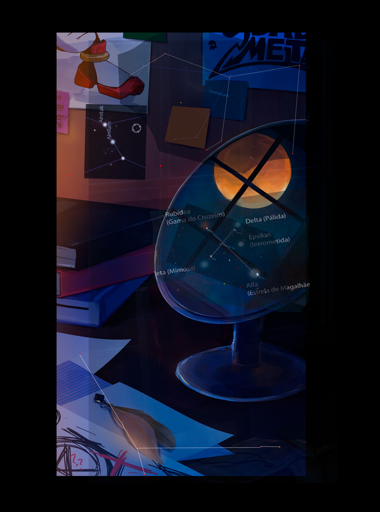

# Meu solve e Minhas anotações

## Links
* oth3r.site/alea-iacta-est
* oth3r.site/parad0xo5
* oth3r.site/viisil
* oth3r.site/you_are_
* oth3r.site/inanis.hz
* oth3r.site/erimia_

## Trauduções
VIS UNITA FORTIOR(Latim) -> UNIDOS VENCEREMOS

ALEA IACTA EST(Latim) -> O DADO FOI LANÇADO (A SORTE FOI LANÇADA)

EXSPECTA AT(Latim) -> ESPEREM EM

SEE OOTAB MIND(Estoniano) -> ESTÁ ME ESPERANDO

MAUVAIS PRÉSAGE(Françes) -> Mau Presságio

Viisil(Estoniano) -> Caminho

Curva Sequere(Latim) -> Siga a Curva

Inanis(Latim) -> Vazio

Erimia_(Grego) -> Solidão

NON MEMINIT(Latim) -> Ele não se lembra


```
 n o n 
meminit
```


# Coisas sobre a Foto da mia
Coisas que temos para usar nesse puzzle da foto da Mia:

A palavra Erimia, ερημιά, que é o url (erimia_) do site (significada deserto em grego. a solitude, an uninhabited region, a waste.)
O quebra cabeça, que ainda não tem um significado
A palavra ''N_O_N meminit'', que significa ''ele não se lembra''
O título da imagem, ''1 - Mia e Lupi''
''Perimetro'' Perímetro é a medida do contorno de uma figura geométrica plana, ou seja, a soma de todos os seus lados

## Coisas da Aghata

Ideia das constelações



